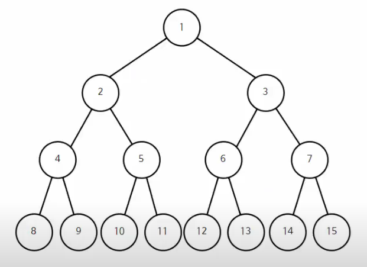
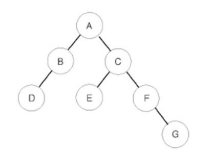

## 이진 트리(Binary  Tree)

- 이진 탐색이 동작할 수 있도록 고안된 효율적인 탐색이 가능한 자료 구조의 일종이다.
- 각 노드의 자식 수가 2 이하인 트리 
- 이진 탐색 트리의 특징 
  - 가장 많이 사용되는 비선형 자료 구조 
  - 왼쪽 노드 < 부모 노드 < 오른쪽 자식 노드
  - 부모 노드보다 왼쪽 자식 노드가 작다.
  - 부모 노드보다 오른쪽 자식 노드가 크다.

> 이진 탐색 트리 데이터 조회하는 과정 (완전 이진 트리 경우)

- 찾고자 하는 원소: 37
- 순서
  - step1 : 루트 노드부터 방문하여 탐색을 진행합니다
  - step2 : 현재 노드와 찾는 원소 37을 비교
  - step3 : 찾는 원소가 더 크므로 오른쪽 방문 
  - step4 : 찾는 원소를 발견하면 탐색 종료


- 이 경우 탐색 과정에서 탐색 범위가 이상적인 경우 절반 가까이 줄어들게 된다. 왼쪽 노드 부분은 볼 필요가 없기 때문!

- 평균 O(logN) 의 시간복잡도 

- **이상적이고, 균형적인 경우인 완전 이진 트리**에서는 **탐색이 빠르게** 가능하다. 

- 완전한 이진 트리가 아닐 경우

  - 배열로 표현하기 어렵기 때문에 <u>포인터</u> 사용, 포인터를 사용하면 안정적으로 작동가능  

  

> 이진트리 데이터 탐색 방법

1. 전위 순회
   - 하나의 노드에 방문했을 때 다음의 순서를 따른다.

​	(1) <u>먼저 자기 자신을 처리한다.</u>

​	(2) 왼쪽 자식을 방문한다.

​	(3) 오른쪽 자식을 방문한다.

2. 중위 순회
   - 하나의 노드에 방문했을 때 다음의 순서를 따른다

​	(1) 왼쪽 자식을 방문한다.

​	(2) <u>먼저 자기 자신을 처리합니다.</u>

​	(3) 오른쪽 자식을 방문합니다.

3. 후위 순회 : 나중에 수식이 있을 때 컴퓨터가 계산하기 좋은 형태로 많이 쓰이는 순회 방식 

​	(1) 왼쪽 자식을 방문합니다.

​	(2) 오른쪽 자식을 방문합니다.

​	(3) <u>먼저 자기 자신을 처리합니다.</u>

> 예시



- 전위 순회 : 1 - 2 - 4 - 8- 9 -5 - 10 - 11- 3 - 6 - 12 -13 - 7 - 14 - 15

- 중위 순회: 8 - 4 - 9 - 2 - 10 - 5 - 11 - 1 - 12 - 6 - 13 - 3 - 14 - 7 - 15
- 후위 순회: 8 - 9 - 4 - 10 - 11  - 5 - 2 - 12 - 13 - 6 - 14 - 15 - 7 - 3 -1

> [백준 1991번 트리순회](.assets/image-20220814094913937.png)

- 전위순회: ABDCEFG / 부모노드-왼쪽자식-오른쪽자식
- 중위순회: DBAECFG / 왼쪽자식-부모노드-오른쪽자식
- 후위순회: DBEGFCA /왼쪽자식-오른쪽자식-루트



```python
'''
입력
7
A B C
B D .
C E F
E . .
F . G
D . .
G . .

'''

import sys

n = int(sys.stdin.readline())
tree = dict()

# 반복문을 통해 트리 생성
for i in range(n):
    root, left, right = map(str, sys.stdin.readline().split())
    tree[root] = left, right


# 전위 순회
def preorder(v):
    if v != ".": # 자식이 있다면
        print(v, end="") # 루트 노드 출력
        preorder(tree[v][0]) # 재귀적으로 왼쪽 노드 탐색
        preorder(tree[v][1]) # 재귀적으로 오른쪽 노드 탐색


# 중위 순회
def inorder(v):
    if v != ".": # 자식이 있다면
        inorder(tree[v][0]) # 재귀적으로 왼쪽 노드 탐색
        print(v, end="") # 루트 노드 출력
        inorder(tree[v][1]) # 재귀적으로 오른쪽 노드 탐색


# 후위 순회
def postorder(v):
    if v != ".": # 자식이 있다면
        postorder(tree[v][0]) # 재귀적으로 왼쪽 노드 탐색
        postorder(tree[v][1]) # 재귀적으로 오른쪽 노드 탐색
        print(v, end="") # 루트 노드 출력


```

